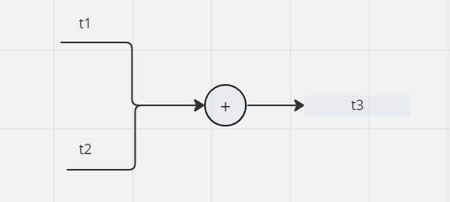

这是 pytorch 加法运算

```python
import torch

t1 = torch.scalar_tensor(2,requires_grad=True)
t2 = torch.scalar_tensor(3,requires_grad=True)
t3 = t1 + t2

print(t3)

t3.backward()
print(t1.grad)
print(t2.grad)
```



```pthon
import torch
from tensor import *
t1 = torch.scalar_tensor(2,requires_grad=True)
t2 = torch.scalar_tensor(3,requires_grad=True)
t3 = t1 + t2

print(t3)

t3.backward()
print(t1.grad)
print(t2.grad)

a_t1 = Tensor(2)
a_t2 = Tensor(3)

a_t3 = a_t1.add(a_t2)
print(a_t3.data)
```

$$
\frac{\partial f(t_1,t_2)}{\partial t1}\\
$$

$$
\frac{\partial f(t_1,t_2)}{\partial t2}\\
$$

```python
class Dot(Function):
  @staticmethod
  def forward(ctx, input, weight):
    ctx.save_for_backward(input, weight)
    return input.dot(weight)

  @staticmethod
  def backward(ctx, grad_output):
    input, weight = ctx.saved_tensors
    grad_input = grad_output.dot(weight.T)
    grad_weight = grad_output.dot(input)
    return grad_input, grad_weight
register('dot', Dot)
```

这里 ctx 